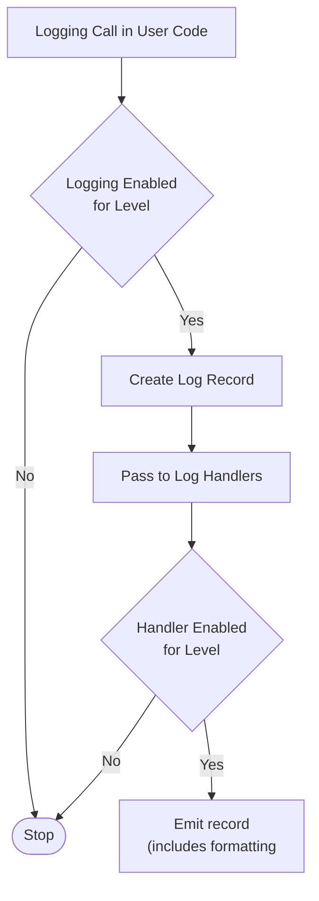

# VBA-LOGGING
Provides a standardized facility for handling log messages in a VBA application.  This library was heavily influenced by the Python logging library and there is a lot of similar functionality.

# Basic Logging

## Logging Levels

Logging functions are named after the level or severity of the events they are used to track. The standard levels and their applicability are described below (in increasing order of severity):

| Level    | When to Use |
| :---     | :--- | 
| CRITICAL | Indicates a serious error where the application may fail to continue running  |
| ERROR    | Indicates an application error where some function failed  |
| WARNING  | Indicates  something unexpected occured and/or warns of furture errors (e.g. 'low disk spave'). Typically software continuies to work as expected |
| INFO     | Provides confirmation things are working as expected |
| DEBUG    | Provides detailed information to support troubleshooting / diagnosis |

Default level is `WARNING`, which means events of this level and above will be tracked unless package is configured to do otherwise.

Tracked events (e.g. logs) can be handled many different ways, however the simplest (and default way) is to print to the console (VBA immediate window).

# Console Example

Import the logging modules into the VBA project. Note most of the class objects have `VB_PredeclaredId` set to `True` so you get a default instance available. To log to the immediate window, add the following lines to your procedure

```
Logging.LogWarning ("Look out!") 'Prints to immediate window
Logging.LogInfo ("Told you so.") 'Will not print to immediate window
```

If you type these lines into a script and run, you’ll see:

```
WARNING - RootLogger - 2023-12-31 17:40:09 - Look out!
```


# Advanced Logging

The logging library takes a modular approach to implemenation and consists of: loggers, handlers, filters, and formatters.
- Loggers expose the interface that application code directly uses.
- Handlers send the log records (created by loggers) to the appropriate destination.
- Filters provide a finer grained facility for determining which log records to output.
- Formatters specify the layout of log records in the final output.

## Logging Flow

## Loggers

Loggers have the following attributes and methods.
> [!CAUTION]
> Loggers should NEVER be instantiated directly, but always through the module-level function ```Logging.GetLogger(Name)```. Multiple calls to ```GetLogger()``` with the same name will always return the same Logger object.


### SetLogLevel(ByVal value As enLogLevel)
Sets the threshold for logging to this logger instance. Log messages below this threshold will be ignored. Log messages at this trheshold or higher will be processed by LogHandlers.

> [!Note]
> LogHandlers have their own LogLevel. If the LogHandler severity Level is higher than the Logger's severity level, not log message will be emited.

> [!Note]
> The root logger is created with level WARNING

### LogCritical(ByVal LogMessage As String)
Logs a message with level ```LogCritical``` on this logger. The LogMessage is the message formated as a string. When creating a log message, the Logger determines if the LogMessage severity level is greater than the server level set in the Logger.  Log messages below the current LogLevel will be ignored. Log messages at this threshold or higher will be passed to the LogHandlers.

### LogError(ByVal LogMessage As String)
Logs a message with level ```LogError``` on this logger. Log is processed in the same manner as ```LogCritical()```

### LogWarning(ByVal LogMessage As String)
Logs a message with level ```LogWarning``` on this logger. Log is processed in the same manner as ```LogCritical()```

### LogInfo(ByVal LogMessage As String)
Logs a message with level ```LogInfo``` on this logger. Log is processed in the same manner as ```LogCritical()```

### LogDebug(ByVal LogMessage As String)
Logs a message with level ```LogDebug``` on this logger. Log is processed in the same manner as ```LogCritical()```

## Handlers

### SetLogLevel(ByVal value As enLogLevel)
Sets the threshold for logging to this handler instance. Log messages below this threshold will be ignored. Log messages at this threshold or higher will be processed.

### SetFormatter(ByVal value as ILogFormatter)
Sets the formatter for this handler.  If no Formatter is specified, the default LogFormatter is used when creating log messages.

### HandleRecord(Record as LogRecord)
Conditionally emits the specified logging record, depending on filters which may have been added to the handler.

### EmitRecord(ByVal Record As LogRecord)
Resonible for emission of the log record.  This method is not called idrectly but invoked by the HandleRecord method

### Function FormatRecord(ByVal Record As LogRecord)
Handled formatting of the log record by applying the assigned formatter. If no formatter is assigned, the default formatter is used. Returns a string value representation of the log record

### Function HasFormatter()
Check to see if a formatter is assigned; returns true is one is assigned and false if no formatter is assigned. 

## Filters
Not implemented yet

## Formatters

Formatters are assigned to Handlers and are responsible for formatting the log records. Only one formatter can be assigned to a handler at a time.

### Format(ByVal Record as ILogRecord)
Returns a string formatted represenation of the log record.
