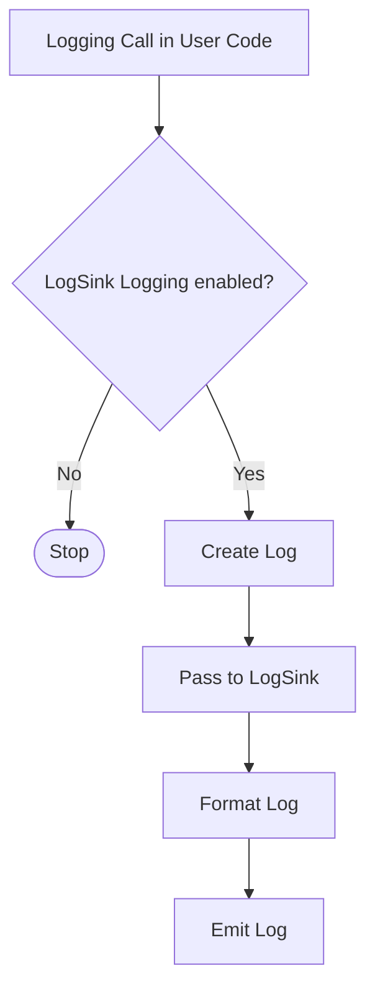

# VBA-LOGGING
Provides a standardized facility for handling log messages in a VBA application.  This library was influenced by the Python logging library and there is a lot of similar functionality.

# Basic Logging

## Logging Levels

Logging functions are named after the level or severity of the events they are used to track. The standard levels and their applicability are described below (in increasing order of severity):

| Level    | When to Use |
| :---     | :--- | 
| CRITICAL | Indicates serious error where the application may fail to continue running  |
| ERROR    | Indicates application error where some function failed  |
| WARNING  | Indicates something unexpected occured and/or warns of furture errors (e.g. 'low disk spave'). Typically software continuies to work as expected |
| SUCCESS  | Indicates something sucessful int he logs |
| INFO     | Provides confirmation things are working as expected |
| TRACE    | Provides detailed information to support troubleshooting / diagnosis |

Default level is `WARNING`, which means events of this level and above will be tracked unless package is configured to do otherwise.

Tracked events (e.g. logs) can be handled many different ways, however the simplest (and default way) is to print to the console (VBA immediate window).

# Console Example

Import the Logger modules into the VBA project. Note most of the class objects have `VB_PredeclaredId` set to `True` so you get a default instance available. To log to the immediate window, add the following lines to your procedure

```
Logger.Warning ("Look out!") 'Prints to immediate window
Logger.Info ("Told you so.") 'Will not print to immediate window
```

If you type these lines into a script and run, you’ll see:

```
WARNING - RootLogger - 2023-12-31 17:40:09 - Look out!
```


# Advanced Logging

The logging library takes a modular approach to implemenation and consists of: Logger, LogSinks, and LogFormatters.
- Logger expose the interface that application code directly uses.
- Formatters specify the layout of log records in the final output.
- LogSinks send log records to the appropriate destination.

## Logging Flow

## LogSinks

LogSinks are used to emit log messages. Each LogSink, has a logging level, and formatter assigned. 
> [!CAUTION]
> LogSinks should not be access directly; rather use the Logger class to access/controll logging actions.

## Logger
Logger is the main entry point to the log application. 

### Add LogSink()
```Logger.AddLogSink("NewLogger, FileLogSink.Create())```.

A default console logger is created with level WARNING

### Logger.Critical(ByVal LogMessage As String, Optional SourceMethodName as String)
Emits log a message with level ```LogCritical``` on to all loggers. LogMessage is the message formated as a string. When processing, Logger determines if severity is greater than log level for each LogSink;  If so log is passed to the LogSink for formatting and emittion.

### Logger.Error(ByVal LogMessage As String, Optional SourceMethodName as String)
Logs a message with level ```LogError``` on this logger. Log is processed in the same manner as ```LogCritical()```

### Logger.Warning(ByVal LogMessage As String, Optional SourceMethodName as String)
Logs a message with level ```LogWarning``` on this logger. Log is processed in the same manner as ```LogCritical()```

### Logger.Info(ByVal LogMessage As String, Optional SourceMethodName as String)
Logs a message with level ```LogInfo``` on this logger. Log is processed in the same manner as ```LogCritical()```

### Logger.Debug(ByVal LogMessage As String, Optional SourceMethodName as String)
Logs a message with level ```LogDebug``` on this logger. Log is processed in the same manner as ```LogCritical()```

## Formatters
Formatters are assigned to Handlers and are responsible for formatting the log records. Only one formatter can be assigned to a handler at a time.
